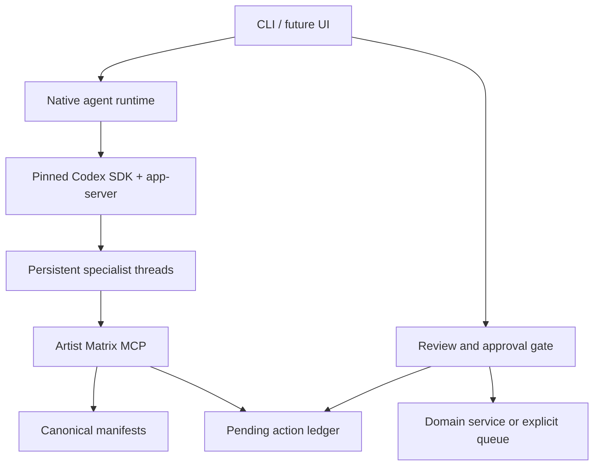

# Artist Matrix

[](https://github.com/shaoqisama/artist-matrix/actions/workflows/ci.yml)
[](https://www.python.org/downloads/)
[](https://github.com/astral-sh/ruff)

Artist Matrix is a Codex-native agent system for creating and operating virtual music artists.
Five persistent agents—Director, Soul Forge, Creation Engine, Echo Chamber, and World Stage—share
canonical product records through a project-local MCP server while the application retains control
of approvals and side effects.

The native runtime follows OpenAI's [Codex open agent harness](https://developers.openai.com/blog/codex-as-a-platform): Artist Matrix owns its product context, domain services, tools, and consent boundary; the pinned Codex SDK owns the thread/turn agent loop, streaming, sandbox, and model interaction.

## Quick start

Requirements: Python 3.11 or 3.12 and [uv](https://docs.astral.sh/uv/).

```bash
uv sync --all-extras --frozen
uv run artist-matrix login
uv run artist-matrix doctor
uv run artist-matrix
```

The native host launches the pinned app-server in an application-owned Codex home and empty product
workspace. It injects the required MCP configuration directly, disables general coding/web/app
tools, and narrows each specialist to its exact product-tool allowlist. The matching
`.codex/config.toml` mirrors the safe defaults for other Codex surfaces in this repository.

Inside chat, use `/agent <role>` to switch specialists, `/scope <artist-slug>` to bind work to a
product scope, and `/help` for the complete command list. Agent threads are durable and resume by
role and scope.

## CLI

```bash
# One persistent interactive thread
uv run artist-matrix chat --agent soul_forge --scope neon-wasteland

# One streamed turn
uv run artist-matrix run --agent creation_engine --scope neon-wasteland \
  "Develop a track concept with a tense synthwave chorus"

# Review application-owned proposals
uv run artist-matrix actions --status pending
uv run artist-matrix approve <action-id>
uv run artist-matrix reject <action-id> --reason "Revise the release date"

# Inspect saved Codex thread bindings
uv run artist-matrix threads
```

The earlier deterministic TUI remains available during migration:

```bash
uv run artist-matrix-legacy
# or set ARTIST_MATRIX_AGENT_RUNTIME=legacy
```

## Native architecture



- `src/artist_matrix/agent_runtime/` contains the harness adapter, normalized stream events,
  specialist registry, durable thread bindings, action ledger, and MCP server.
- `src/artist_matrix/prompts/agents/` contains packaged, versioned specialist instructions.
- `.codex/config.toml` declares the required project-local MCP server.
- `data/actions/` contains typed, reviewable proposals. Codex can propose and inspect actions, but
  the MCP surface deliberately exposes no approve, reject, execute, shell, or arbitrary file tool.
- `data/artists/` and per-track manifests remain canonical. Codex thread history is context, not
  product state.
- The embedded runtime has a closed tool universe: only the required Artist Matrix MCP server is
  loaded; shell, filesystem/image tools, browser/computer use, web search, apps, plugins, hooks,
  skills, and subagents are disabled. It also uses `deny_all` approvals and a custom permission
  profile that can read only minimal runtime paths and the empty agent workspace.
- Consequential work crosses the application-owned `prepare -> review -> approve -> execute`
  boundary. Unconfigured remote work becomes a `queued` outbox record with
  `external_effect=not_executed`; it is never reported as provider completion.

See [`docs/architecture_codex_native.md`](docs/architecture_codex_native.md) for the contracts and
extension guide, and [`docs/workflows.md`](docs/workflows.md) for product flows.

## Configuration

Copy `.env.example` to `.env`. Native runtime settings include:

- `ARTIST_MATRIX_AGENT_RUNTIME=codex|legacy`
- `ARTIST_MATRIX_CODEX_MODEL` to override the Codex account default
- `ARTIST_MATRIX_CODEX_BIN` only to intentionally override the SDK-pinned runtime
- `ARTIST_MATRIX_CODEX_HOME` for the isolated runtime/authentication home (defaults to
  `.cache/codex-home`)
- `ARTIST_MATRIX_CODEX_WORKSPACE` for the empty agent workspace; it must remain inside that home
- `ARTIST_MATRIX_CODEX_THREAD_STORE` for the role/scope thread registry
- `ARTIST_MATRIX_ACTION_ROOT` for reviewable action records
- `ARTIST_MATRIX_AGENT_PROMPTS_ROOT` only when replacing the packaged specialist instructions

Provider settings for DeepSeek, avatar generation, and Suno remain available to legacy workflows
and approved host adapters. They are never forwarded to the model through MCP. Persona approval
uses the existing profile/avatar services, and approved local track renders use the existing
Creation Engine directly. Remote providers are queued until their adapter propagates the action
UUID as a provider idempotency key.

## Development

```bash
uv sync --all-extras --frozen
uv run make verify
```

Tests use a fake harness and never require live Codex credentials. Update agent instructions,
tool allowlists, action schemas, docs, and contract tests together when changing a native workflow.
See `AGENTS.md` for the contributor checklist and `docs/project_plan.md` for milestones.
