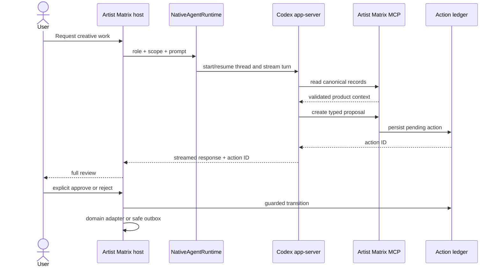
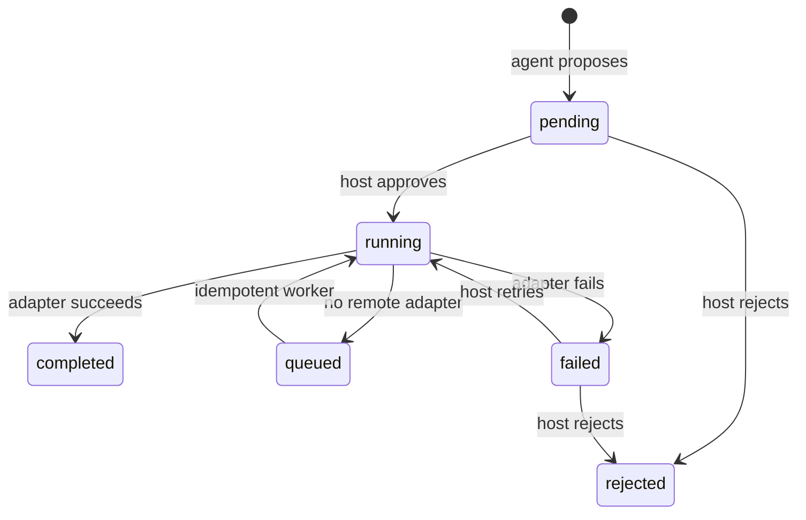

# Codex-Native Architecture

Artist Matrix uses Codex as an open agent harness rather than implementing another bespoke chat
loop. The host application owns the music-domain contract and Codex owns the reusable agent
runtime. This split follows the architecture described in
[Codex as a platform](https://developers.openai.com/blog/codex-as-a-platform).

## Ownership boundary

| Concern | Owner |
| --- | --- |
| Thread and turn lifecycle, model interaction, event stream, sandbox | Pinned Codex SDK/app-server |
| Artist/track/release schemas and canonical state | Artist Matrix domain packages |
| Specialist instructions and allowed product tools | `agent_runtime/definitions.py`, `src/artist_matrix/prompts/agents/` |
| Product reads and proposal creation | Project-local `artist-matrix` MCP server |
| Consent, action approval, rejection, and execution | Artist Matrix CLI/application |
| Provider credentials and external adapters | Artist Matrix settings/domain services |

The SDK is pinned with its matching CLI runtime. `ARTIST_MATRIX_CODEX_BIN` is an escape hatch for
intentional compatibility testing, not the normal configuration.

## Runtime flow

`NativeAgentRuntime` binds each `(role, scope)` pair to a persisted Codex thread ID. It deliberately
does not recreate a missing or stale thread silently: the operator clears that binding with `/new`
after deciding to lose its conversational context. Product manifests remain canonical even when a
thread is discarded.

## Specialist registry

| Role | Purpose | Proposal tool |
| --- | --- | --- |
| `director` | Coordinate a complete artist lifecycle | All proposal types |
| `soul_forge` | Develop an artist identity | `propose_artist_profile` |
| `creation_engine` | Co-create a production-ready track brief | `propose_track_render` |
| `echo_chamber` | Plan an audience campaign | `propose_social_campaign` |
| `world_stage` | Validate release distribution metadata | `propose_release` |

Every role can use the product read tools: `list_artists`, `get_artist`, `list_tracks`, `get_track`,
`list_actions`, and `get_action`. The host configures `enabled_tools` with the exact role allowlist
on both thread start and resume; the prompt repeats that boundary for clarity but is not the
enforcement mechanism. The server-level union is safe because every write-capable tool creates
only a pending proposal; approval and execution are not in the model tool surface.

## Harness adapter

`CodexHarness` is the only module coupled to `openai_codex`. It uses the public
[Codex SDK](https://developers.openai.com/codex/codex-sdk) surface and:

- starts one long-lived app-server process per CLI session;
- runs it under an application-owned `CODEX_HOME` and an empty workspace, isolating authentication,
  rollout history, user MCP servers, project instructions, skills, apps, and plugins;
- starts or resumes named threads with `service_name="artist_matrix"`;
- disables every non-product tool family, including shell, filesystem/image, browser/computer-use,
  web, apps/plugins, skills, hooks, code mode, permission prompts, and subagents;
- applies exact role MCP tools and `ApprovalMode.deny_all` at thread and turn boundaries, while the
  runtime default uses the `artist_matrix_readonly` permission profile;
- consumes the streamed turn once and extracts the authoritative final agent message;
- translates SDK notifications into stable Artist Matrix `RuntimeEvent` values;
- requires `turn/completed` and normalizes transport, setup, authentication, and turn failures;
- checks refreshed authentication, SDK/server version parity, and required MCP startup in
  `artist-matrix doctor`.

The disabled-feature overrides use the documented
[Codex configuration reference](https://developers.openai.com/codex/config-reference) and are
contract-tested against the pinned 0.147.0 runtime's effective feature list. The custom
[permission profile](https://developers.openai.com/codex/permissions) grants read access only to
Codex's minimal runtime paths and the empty agent workspace, with command network access disabled.
The SDK does not pass the older `sandbox` override because doing so would replace this narrower
profile with the app-server's full-read `readOnly` default.

The CLI renders message deltas and concise tool status. Reasoning deltas are represented in the
internal event contract for observability adapters but are never printed to users.

## MCP contract

The native host injects its stdio [MCP](https://developers.openai.com/codex/mcp) command and server
allowlist through public
`CodexConfig.config_overrides`, so it never depends on project trust for its product boundary.
`CodexConfig.env` supplies only the isolated Codex home and host-derived data/action roots; provider
credentials are not part of any model tool result. Per-thread config then narrows the server to the
active specialist's exact tools.
`.codex/config.toml` mirrors that configuration for other Codex surfaces once the repository is
trusted. The server is required: failing MCP startup fails thread creation instead of quietly
running an agent without canonical product context.

The server has a fixed allowlist:

- read validated Artist Matrix records;
- inspect existing action records;
- create one of four typed pending proposals.

It has no approval, rejection, execution, provider, shell, or arbitrary filesystem tool. Slugs are
validated, model-supplied path fields are rejected recursively, and all file locations are derived
from host settings.

## Approval and action ledger

Actions use the state machine below:

Records are typed Pydantic models persisted as atomic JSON files. Revision compare-and-swap and
per-action OS locks serialize execution across processes. Re-approving a completed or queued action
returns the existing result without running it twice. Handlers receive the stable action UUID as a
provider idempotency key; stale `running` records fail for reconciliation before an explicit retry.
Persona approval uses the existing profile repository and configured local avatar generator.
Approved local/stub track renders use the existing Creation Engine. Work without an idempotent
adapter writes a deterministic envelope to `data/outbox/` and enters `queued` with
`external_effect=not_executed`.

The supported kinds are:

| Kind | Validated payload | Default approved adapter |
| --- | --- | --- |
| `save_persona` | Complete `ArtistProfile` | Canonical artist manifest + configured local avatar generator |
| `render_track` | Artist slug + finalized `TrackIdeationDraft` | Creation Engine for local/stub audio; otherwise queue |
| `schedule_campaign` | Artist, platform, beats, cadence | Explicit local queue until a social client adapter is configured |
| `dispatch_release` | Artist, track, date, platforms, metadata | Explicit local queue until a distribution adapter is configured |

## Persistence

- `ARTIST_MATRIX_CODEX_HOME` defaults to `.cache/codex-home/`; it contains only this product's auth
  state and Codex rollout history.
- `ARTIST_MATRIX_CODEX_THREAD_STORE` defaults to `.cache/codex-home/agent_threads.json`.
- `ARTIST_MATRIX_ACTION_ROOT` defaults to `data/actions/`.
- Safe unconfigured execution envelopes live under `data/outbox/`.
- Artist and track records keep their existing `data/artists/` layout.
- Thread bindings are namespaced by Codex home, workspace, and model. Registry updates and
  same-role/scope turns are cross-process locked so concurrent surfaces cannot lose bindings or run
  the same thread simultaneously.
- The namespace includes the runtime security-policy version, so a permission-boundary change
  starts fresh threads instead of resuming a thread that retained an older sandbox policy.
- Artist Matrix stores only thread IDs, never copied transcripts or authentication material.

## Testing contract

Domain tests never require a live model or credentials. `AgentHarness` is a protocol, and runtime
tests inject a deterministic fake. Adapter tests feed generated notification objects into the
normalizer and assert stream completion, error handling, response extraction, usage, and closure.
MCP tests inspect the registered FastMCP tool set and assert the absence of approval/execute tools.
Action tests cover atomic persistence, validation, cross-process execution, stale recovery,
rejection, queuing, and idempotency. Packaging tests build and inspect a wheel to verify specialist
prompts are included outside a source checkout.

## Extending a native workflow

1. Add or change a domain schema first; canonical data must not depend on Codex history.
2. Add a typed action payload and deterministic application adapter for consequential work.
3. Add a read or propose-only MCP handler. Never expose the executor through MCP.
4. Update the role's definition and its versioned prompt together.
5. Add fake-harness, MCP allowlist, action-transition, and domain tests.
6. Update this document and `docs/workflows.md` when the cross-agent contract changes.

The previous classic/Rich TUI remains behind `artist-matrix-legacy` while product surfaces migrate
onto `NativeAgentRuntime`. It is a compatibility adapter, not the source of new orchestration
behavior.
